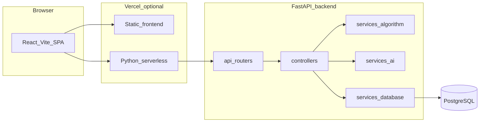

# Occumax — Technical specification (contributor quick reference)

This document summarizes how the repository is structured, how major features are implemented, and how configuration and deployment behave. It is meant as a **fast orientation** for contributors; authoritative behavior still lives in the code paths cited below.

---

## 1. Purpose and audience

- **Audience**: Engineers contributing to the Occumax hotel yield / calendar optimisation platform.
- **Scope**: Monorepo layout, backend layering, frontend integration, environment variables, deployment (Vercel), testing entry points, and notable implementation caveats.
- **Not a substitute for**: Reading routers and controllers when changing API contracts or persistence.

---

## 2. High-level architecture

The product is a **React single-page application** that talks to a **FastAPI** backend backed by **PostgreSQL**. Deterministic calendar logic (gaps, shuffles, booking placement) lives in Python services; **Google Gemini** powers optional AI flows (receptionist chat, manager pricing analysis) via LangGraph / LangChain.

**Request path**: `frontend/src/api/client.ts` (axios base URL) → FastAPI routers under `backend/api/` → `backend/controllers/` → `backend/services/` (algorithm, AI, database session).

---

## 3. Repository map

| Path | Role |
|------|------|
| `frontend/` | Vite + React 19 + TypeScript + Tailwind. Routes: Manager (Yield + Pricing), **Dashboard** (Bird's Eye View at `/dashboard`), Receptionist, Admin (`frontend/src/App.tsx`, `frontend/src/pages/ManagerDashboard.tsx`, `frontend/src/pages/Dashboard.tsx`). |
| `frontend/src/api/client.ts` | Central API client; mirrors backend routes used by the UI. |
| `backend/main.py` | FastAPI app assembly, CORS, global exception handler, router includes, startup `create_tables`. |
| `backend/config.py` | Pydantic-settings: `DATABASE_URL`, AI key, hotel name, scan/booking windows, gap costs, optimiser caps. |
| `backend/api/` | Thin HTTP routers (dashboard, manager, pricing, receptionist, admin, AI). |
| `backend/controllers/` | Orchestration: DB queries, calls into services, response shaping. |
| `backend/core/models/` | SQLAlchemy 2 declarative models (`Room`, `Slot`, `Booking`, enums). |
| `backend/core/schemas/` | Pydantic request/response models per domain. |
| `backend/services/algorithm/` | Deterministic optimisation and booking logic (calendar optimiser, placement, split stay). |
| `backend/services/ai/` | LangGraph agents (receptionist, pricing). |
| `backend/services/database.py` | Async engine/session, `get_db`, `create_tables`, SSL URL handling for hosted Postgres. |
| `backend/tests/` | API and AI agent tests (`pytest`). |
| `vercel.json` (root) | Monorepo-style `experimentalServices`: frontend at `/`, backend under `/_/backend`. |
| `backend/vercel.json` | `@vercel/python` build pointing at `main.py`. |
| `.cursor/skills/` | **This repo only** — optional Cursor Agent Skills; see `occumax-change-workflow` for contributor change discipline. |

---

## 4. Runtime stack

**Backend** ([`backend/requirements.txt`](backend/requirements.txt)):

- FastAPI, Uvicorn, SQLAlchemy 2 (async), asyncpg, Pydantic / pydantic-settings, httpx, python-multipart.
- Optional / AI: LangGraph, LangChain core, LangChain Google GenAI (Gemini).
- Alembic and psycopg2-binary are listed; **day-to-day schema evolution** in this repo uses SQLAlchemy `create_all` plus idempotent `ALTER TABLE` in `create_tables()` — there is no documented Alembic revision chain in-tree.

**Frontend** ([`frontend/package.json`](frontend/package.json)):

- React 19, React DOM 19, React Router 7, Vite 8, TypeScript ~5.9, Tailwind 3.4, axios, date-fns, lucide-react, clsx.

**API identity**: FastAPI title `Occumax API`, version `3.0.0` ([`backend/main.py`](backend/main.py)). The UI branding uses “Optihost” in places — a product naming mismatch only.

---

## 5. API quick reference

Base URL: from `VITE_API_URL` or `http://localhost:8000` ([`frontend/src/api/client.ts`](frontend/src/api/client.ts)).

| Prefix | Method | Path | Purpose |
|--------|--------|------|---------|
| — | GET | `/health` | Liveness; returns `status` and `hotel` from settings. |
| `/dashboard` | GET | `/heatmap` | Heatmap payload for the manager view. |
| `/manager` | POST | `/optimise` | Run T1 calendar optimisation **in memory**; returns swap plan and gap metadata (no DB write). |
| `/manager` | POST | `/commit` | Atomically apply a previously returned swap plan to slots. |
| `/manager/pricing` | GET | `/analyse` | Run pricing AI on live occupancy; returns recommendations (no DB write). |
| `/manager/pricing` | POST | `/commit` | Apply reviewed rate changes to slots. |
| `/receptionist` | POST | `/check` | Availability / shuffle preview for a category and stay dates. |
| `/receptionist` | POST | `/confirm` | Confirm booking in a chosen room; optional swap plan. |
| `/receptionist` | POST | `/find-split` | Propose split-stay options. |
| `/receptionist` | POST | `/confirm-split` | Persist split-stay segments and discounts. |
| `/receptionist` | GET | `/bookings` | List bookings for receptionist workflows. |
| `/admin` | GET | `/rooms` | List rooms. |
| `/admin` | POST | `/rooms` | Create room. |
| `/admin` | PATCH | `/rooms/{room_id}` | Update room fields / soft-deactivate. |
| `/admin` | DELETE | `/rooms/{room_id}` | Delete room. |
| `/admin` | GET | `/categories` | List room categories. |
| `/admin` | PATCH | `/slots/{slot_id}` | Patch individual slot (admin tooling). |
| `/ai` | GET | `/context` | Serialized hotel snapshot for injecting into the chat agent. |
| `/ai` | POST | `/chat` | One conversational turn; client may send full message history. |
| `/analytics` | GET | `/occupancy-forecast` | Expected vs on-the-books vs realized occupancy (by category + rollup) for a requested window. |
| `/analytics` | GET | `/pace` | Pickup / pace curve: on-the-books vs historical on-the-books at matching lead times (by category + rollup). |
| `/analytics` | GET | `/event-insights` | LOS and arrival-pattern insights for a requested window (beta). |

Implementation files: [`backend/api/dashboard.py`](backend/api/dashboard.py), [`backend/api/manager.py`](backend/api/manager.py), [`backend/api/pricing.py`](backend/api/pricing.py), [`backend/api/receptionist.py`](backend/api/receptionist.py), [`backend/api/admin.py`](backend/api/admin.py), [`backend/api/ai.py`](backend/api/ai.py).

**Manager optimisation flow** (deterministic): `POST /manager/optimise` loads slots in the configured window, runs gap detection / shuffle planning ([`backend/controllers/manager.py`](backend/controllers/manager.py), [`backend/services/algorithm/calendar_optimiser.py`](backend/services/algorithm/calendar_optimiser.py)), returns steps; `POST /manager/commit` applies those steps transactionally.

---

## 6. Data model (conceptual)

- **`rooms`**: `id` (e.g. room number string), `category` ([`RoomCategory`](backend/core/models/enums.py)), `base_rate`, `floor_number`, `is_active`.
- **`slots`**: One row per room per date; `block_type` (`HARD` / `SOFT` / `EMPTY`), optional `booking_id`, `current_rate`, `floor_rate`, `channel`, min-stay flags. Primary key pattern `roomId_date` is used in application code comments.
- **`bookings`**: Guest and stay dates, `room_category`, optional `assigned_room_id`, `is_live`, timestamps. **Split stay**: `stay_group_id`, `segment_index`, `discount_pct` ([`backend/core/models/booking.py`](backend/core/models/booking.py)).

**Enums** ([`backend/core/models/enums.py`](backend/core/models/enums.py)):

- `BlockType`: `HARD` (immovable), `SOFT` (movable booking), `EMPTY`.
- `Channel`: OTA, DIRECT, GDS, WALKIN, CLOSED.

Startup migration behavior: [`create_tables()`](backend/services/database.py) runs `Base.metadata.create_all`, then separate `ALTER TABLE ... IF NOT EXISTS` statements for columns that may be missing on older databases (`bookings.stay_group_id`, `segment_index`, `discount_pct`; `slots.floor_rate`).

---

## 7. Configuration

All tunables are centralized in [`backend/config.py`](backend/config.py) and load from environment / `.env` (pydantic-settings).

| Area | Variables / concepts |
|------|----------------------|
| Infrastructure | `DATABASE_URL` (normalised to `postgresql+asyncpg://` from `postgres://` or `postgresql://` for platform compatibility). `CORS_ORIGINS` exists in settings but see **Contributor notes** below. |
| AI | `GEMINI_API_KEY` — required for `/ai/*` and pricing analysis paths. |
| Identity | `HOTEL_NAME`. |
| Windows | `SCAN_WINDOW_DAYS` (heatmap / gap scan horizon), `BOOKING_WINDOW_DAYS` (receptionist placement horizon; should be ≤ scan window). |
| Gaps | `MAX_GAP_NIGHTS`, anti-fragmentation cost table `GAP_COST_*`. |
| Optimiser caps | `MAX_SWAP_STEPS`, `MAX_OUTER_ITERATIONS`, `MAX_SHUFFLE_DFS_EVALS`. |

Examples and platform hints: [`backend/.env.example`](backend/.env.example), [`frontend/.env.example`](frontend/.env.example) (`VITE_API_URL`).

---

## 8. Local development

1. **PostgreSQL**: Create a database and set `DATABASE_URL` in `backend/.env` (see `.env.example`).
2. **Backend**: From `backend/`, install dependencies (`pip install -r requirements.txt`), run Uvicorn against `main:app` (e.g. `uvicorn main:app --reload --host 0.0.0.0 --port 8000`).
3. **Frontend**: From `frontend/`, `npm install`, copy `frontend/.env.example` to `.env.local` and set `VITE_API_URL` to the backend origin, then `npm run dev`.
4. **Smoke check**: `GET /health` on the backend.

---

## 9. Testing

- Location: [`backend/tests/`](backend/tests/) — e.g. [`test_api.py`](backend/tests/test_api.py), [`test_ai_agent.py`](backend/tests/test_ai_agent.py).
- Typical invocation (from `backend/` with dev dependencies installed): `pytest`.

---

## 10. Deployment (Vercel)

- Root [`vercel.json`](vercel.json): `experimentalServices` maps the **Vite** frontend to `/` and the **Python** API to `/_/backend` (path prefix for the serverless function bundle).
- [`backend/vercel.json`](backend/vercel.json): `@vercel/python` with `main.py` as entry and catch-all route to the ASGI app.

Frontend builds must receive **`VITE_API_URL`** at build time pointing at the deployed API (including the `/_/backend` prefix if that is how the monorepo exposes the API).

---

## 11. Contributor notes (implementation caveats)

### 11.1 CORS

[`backend/.env.example`](backend/.env.example) documents `CORS_ORIGINS`, and [`backend/config.py`](backend/config.py) defines `CORS_ORIGINS`, but [`backend/main.py`](backend/main.py) currently registers `CORSMiddleware` with `allow_origins=["*"]`. Do not assume environment-driven CORS is enforced until the middleware is wired to `settings.CORS_ORIGINS` (split/parsed as needed).

### 11.2 Database SSL (hosted Postgres / Aiven)

[`backend/services/database.py`](backend/services/database.py) strips `sslmode=*` query parameters from the URL (asyncpg incompatibility) and, when SSL is implied, attaches an SSL context with **certificate verification disabled** to accommodate providers with self-signed chains while still using TLS. This is a deliberate trade-off for connectivity; tighten verification if your deployment provides a proper CA bundle.

### 11.3 Error responses and CORS

[`backend/main.py`](backend/main.py) registers a global `Exception` handler that returns JSON **and** sets `Access-Control-Allow-Origin: *`, because unhandled 500s may not receive CORS headers from Starlette’s middleware alone.

---

## 12. Changelog

### 12.1 How to maintain this section

After each meaningful merge to the default branch, add a **short dated bullet** (what changed, why it matters). Keep the newest entries at the top. Link PRs or commits when useful.

### 12.2 Project history (from git, condensed)

Newest first; reflects repository history at documentation time.

| When (approx.) | Summary |
|----------------|---------|
| 2026-04-14 | Bird's Eye **Dashboard** polish: default date span **3 weeks**; room-type chips reuse the same inverted active styling as the week chips; spacing between the AI forecast block and the occupancy row; **Availability at a glance** uses **donut** charts per bucket; section titles share one **uppercase sans** header style with the heatmap title (`Dashboard.tsx`, `BirdseyeFilters.tsx`, `BirdseyeForecastInsights.tsx`, `BirdseyeInventoryHighlights.tsx`). |
| 2026-04-14 | Added additive **Analytics** endpoints (`/analytics/*`) for Bird's Eye Dashboard: occupancy forecast (seasonal baseline + recent trend + confidence band), pace (on-the-books vs historical lead time), and event LOS/arrival insights (beta). |
| 2026-04-13 | Bird's Eye **Dashboard** (`/dashboard`): client-side **filter bar** — 1 / 2 / 3 week horizon (initial default was 2 weeks, later **3 weeks**) and Standard / Deluxe / Suite toggles (default all three); filters `HeatmapGrid` + **Availability at a glance** only (`BirdseyeFilters.tsx`, `Dashboard.tsx`). `getHeatmap` and other routes unchanged. |
| 2026-04-13 | Bird's Eye side panel (`computeEmptyRunInventory`) counts **overlapping k-night bookable windows** inside each maximal EMPTY strip (not one tally per strip length); UI copy updated in `BirdseyeInventoryHighlights.tsx`. |
| 2026-04-13 | **Bird's Eye View** is a dedicated **Dashboard** page at `/dashboard` (nav: Dashboard) — 70/30 **Current Occupancy** heatmap + **Availability at a glance** side panel (k-night bookable window counts); Manager page is Yield + Pricing only (`Dashboard.tsx`, `BirdseyeInventoryHighlights.tsx`, `utils/inventoryAvailability.ts`; `GET /dashboard/heatmap`). |
| 2026-04-13 | Added **project-scoped** Cursor skill **occumax-change-workflow** (`.cursor/skills/occumax-change-workflow/SKILL.md`); documented `.cursor/skills/` in the repository map (not intended as a global/personal skill). |
| Merge PR #4 | Removed legacy product / roadmap / solution design binary and markdown files from the repo (documentation cleanup). |
| — | **fix**: SSL context for asyncpg with Aiven-style self-signed certificates (`database.py`). |
| — | **fix**: Strip `sslmode` query parameter from database URL for asyncpg compatibility. |
| — | **fix**: Translate `postgres://` URL prefix to `postgresql+asyncpg://` for hosted providers (e.g. Aiven on Vercel). |
| — | **fix**: Split `create_tables()` into two transactions — `create_all` then idempotent `ALTER TABLE`, so new columns apply reliably. |
| — | Added root **Vercel monorepo** config (`experimentalServices`) for combined frontend + backend deployment. |
| — | Added **`backend/.env.example`** and **`frontend/.env.example`** with platform-agnostic deployment notes. |
| Initial commit | **Occumax** hotel revenue recovery platform: FastAPI backend, React frontend, calendar optimisation, receptionist and admin flows, AI integration. |

---

## 13. Related files index

| Concern | Primary files |
|---------|----------------|
| App entry & middleware | [`backend/main.py`](backend/main.py) |
| Settings | [`backend/config.py`](backend/config.py) |
| DB session & bootstrap | [`backend/services/database.py`](backend/services/database.py) |
| Optimisation pipeline | [`backend/services/algorithm/calendar_optimiser.py`](backend/services/algorithm/calendar_optimiser.py), [`backend/controllers/manager.py`](backend/controllers/manager.py) |
| Booking / split stay algorithms | [`backend/services/algorithm/booking_placement.py`](backend/services/algorithm/booking_placement.py), [`backend/services/algorithm/split_stay.py`](backend/services/algorithm/split_stay.py) |
| AI agents | [`backend/services/ai/receptionist_agent.py`](backend/services/ai/receptionist_agent.py), [`backend/services/ai/pricing_agent.py`](backend/services/ai/pricing_agent.py) |
| Frontend API surface | [`frontend/src/api/client.ts`](frontend/src/api/client.ts) |
| Bird's Eye Dashboard | [`frontend/src/pages/Dashboard.tsx`](frontend/src/pages/Dashboard.tsx), [`frontend/src/components/BirdseyeFilters.tsx`](frontend/src/components/BirdseyeFilters.tsx), [`frontend/src/components/BirdseyeInventoryHighlights.tsx`](frontend/src/components/BirdseyeInventoryHighlights.tsx) |
